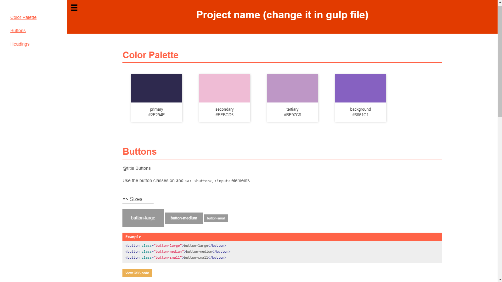

# psg-theme-tomato

Theme for the [postcss-style-guide](https://github.com/morishitter/postcss-style-guide) plugin

## Install

```shell
$ npm install psg-theme-tomato
```
## Example

```shell
var gulp = require('gulp');
var sourcemaps = require('gulp-sourcemaps');
var postcss = require('gulp-postcss');
var minifyCSS = require('gulp-clean-css');
var rename = require("gulp-rename");
var sass = require('gulp-sass');
var styleGuide = require('postcss-style-guide');

// Transpiling scss
gulp.task('css', () => {
    console.log("Transpiling scss, etc...");
    return gulp.src('./*.scss')
        .pipe(sourcemaps.init())
        .pipe(sass().on('error', sass.logError))
        .pipe(postcss([
            styleGuide({
                project: 'Project name',
                dest: 'styleguide/index.html',
                showCode: true,
                theme: 'tomato' // => Add name of the theme here
            })
        ]))
        .pipe(minifyCSS({compatibility: 'ie8'}))
        .pipe(rename({
          suffix: '.min'
        }))
        .pipe(sourcemaps.write('.'))
        .pipe(gulp.dest('./dist/css/'));
});

gulp.task('watch', () => {
    gulp.watch('./*.scss', ['css']);
});

gulp.task('default', ['css']);
```

## Theme



## License

MIT © bar
